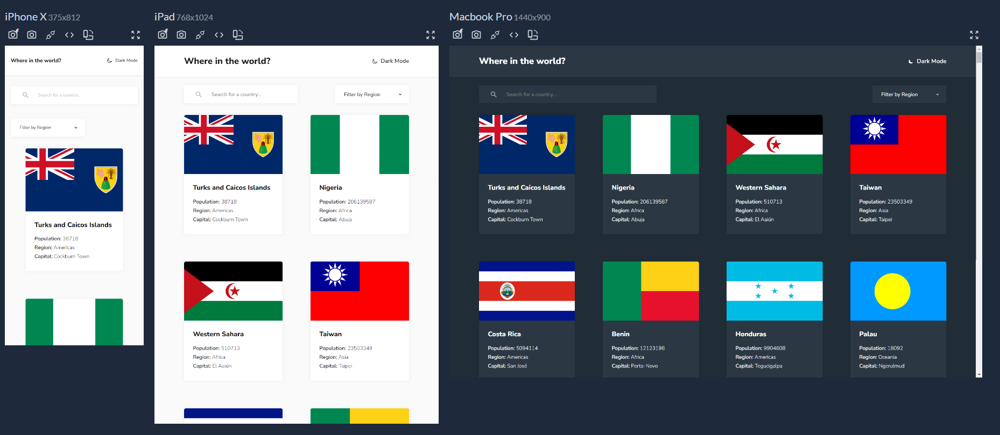

# WHERE IN THE WORLD?

Where in the World? is a responsive web application built with React, React Router, and Tailwind CSS, inspired by a Figma design layout provided by FrontendMentor.

## Features:

- Responsive design for various screen sizes.
- Interactive web application using React.
- Utilizes React Router for seamless navigation between pages.
- Stylish and maintainable UI with Tailwind CSS.

### FrontendMentor Challenge:

[https://www.frontendmentor.io/challenges/rest-countries-api-with-color-theme-switcher-5cacc469fec04111f7b848ca](https://www.frontendmentor.io/challenges/rest-countries-api-with-color-theme-switcher-5cacc469fec04111f7b848ca)

### Demo:

[https://where-in-the-world-react-tailwind.vercel.app/](https://where-in-the-world-react-tailwind.vercel.app/)

### FrontendMentor Profile:

[https://www.frontendmentor.io/profile/Ronaldodev03](https://www.frontendmentor.io/profile/Ronaldodev03)
